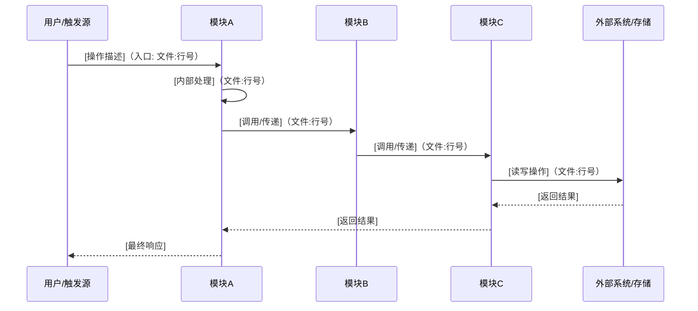
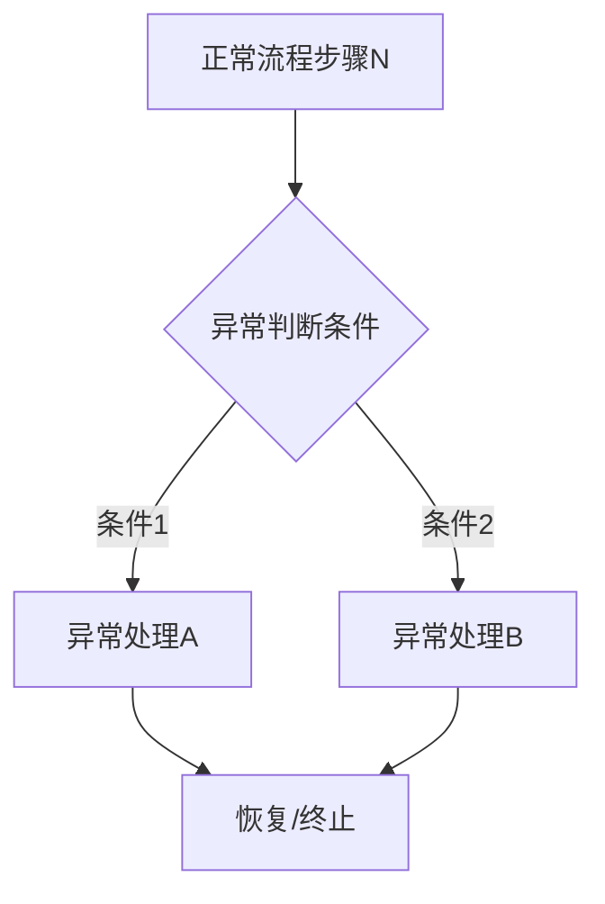
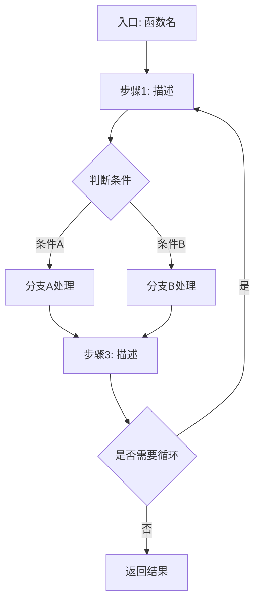
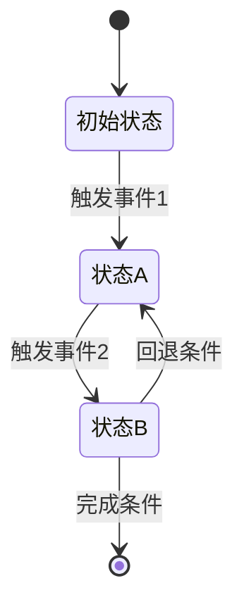
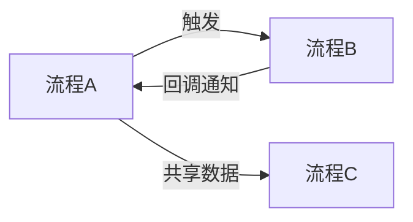

# 核心工作流

## 端到端业务流程

识别项目中 3-5 个最核心的业务流程，每个流程按以下结构说明：

### [流程名称，如 用户注册 / 订单处理 / 数据同步]

**它是什么**：[一句话说明这个流程完成什么业务目标]
**触发方式**：[用户操作 / 定时任务 / 外部事件 / API 调用]

**流程全景**（标注涉及的模块和关键文件）：

**关键步骤说明**：

| 步骤 | 负责模块 | 做什么 | 为什么在这一步 | 代码位置 |
|------|---------|--------|--------------|----------|
| 1 | [模块名] | [操作描述] | [为什么需要这一步] | `文件:行号` |
| 2 | ... | ... | ... | ... |

**异常分支**：

| 异常场景 | 触发条件 | 处理方式 | 对用户的影响 |
|---------|---------|---------|-------------|
| [场景描述] | [什么条件下触发] | [重试/降级/报错/忽略] | [用户看到什么] |

---

## 模块内部执行流程

对系统中最核心的 2-3 个模块，深入展示其内部执行逻辑：

### [模块名称] 内部流程

**它是什么**：[这个模块的核心职责]
**为什么需要详细了解**：[这个模块的复杂度在哪里，为什么不能当黑盒看待]

**执行流程**：

**关键决策点**：

| 决策点 | 判断条件 | 影响 | 代码位置 |
|--------|---------|------|----------|
| [决策描述] | [什么条件决定走哪条路] | [不同分支导致什么不同结果] | `文件:行号` |

**状态转换**（如果模块涉及状态管理）：

| 状态 | 含义 | 进入条件 | 退出条件 |
|------|------|---------|---------|
| [状态名] | [代表什么] | [什么条件进入] | [什么条件离开] |

---

## 流程间的关联

[说明上述流程之间是否有依赖、共享状态、或触发关系]

