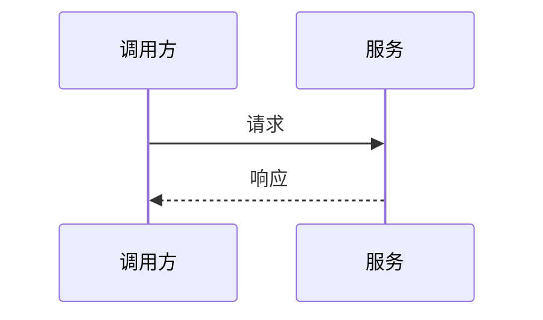

# {标题} 技术方案

## 1. 背景

## 2. 目标与非目标

### 目标

### 非目标

## 3. 当前系统现状

### 已验证事实

### 假设

## 4. 方案概览

## 5. 详细设计

### 5.1 模块边界

### 5.2 数据模型

### 5.3 API / 接口

### 5.4 核心流程

### 5.5 权限、安全与隐私

### 5.6 错误处理与降级

### 5.7 可观测性

## 6. 备选方案

| 方案 | 优点 | 成本 / 风险 | 结论 |
| --- | --- | --- | --- |
| 方案 A |  |  |  |
| 方案 B |  |  |  |

## 7. 迁移与发布计划

## 8. 测试与验收

## 9. 风险与应对

| 风险 | 影响 | 应对 |
| --- | --- | --- |
|  |  |  |

## 10. 实施任务拆分

- [ ]

## 11. 待确认问题

-
