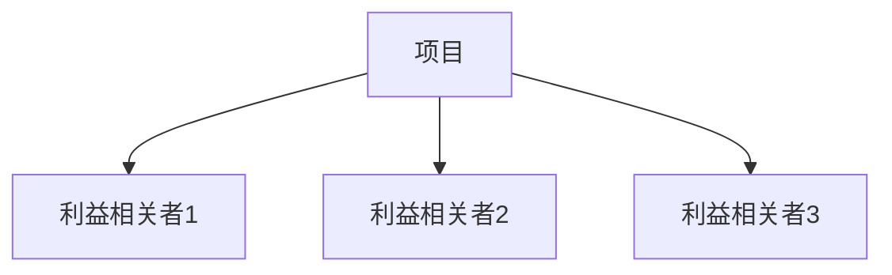

# 需求分析模板

## 文档信息

| 项目 | 内容 |
|------|------|
| 功能名称 | |
| 版本 | v1.0 |
| 分析师 | |
| 状态 | 草稿 / 评审中 / 已批准 |
| 最后更新 | {日期} |

---

## 1. 问题发现

### 1.1 核心问题
<!-- 用一句话描述核心问题 -->

### 1.2 问题影响者
<!-- 谁有这个问题？用户画像 -->

### 1.3 当前解决方案
<!-- 用户现在如何解决这个问题 -->

### 1.4 问题影响
<!-- 不解决这个问题会有什么影响 -->

---

## 2. 利益相关者分析

| 利益相关者 | 角色 | 利益 | 影响力 |
|------------|------|------|--------|
| | | | 高/中/低 |

---

## 3. 需求分类

### 3.1 功能性需求

| 需求ID | 描述 | 来源 | 优先级 |
|--------|------|------|--------|
| FR-001 | | | P0/P1/P2 |

### 3.2 非功能性需求

| 需求ID | 类型 | 描述 | 指标 |
|--------|------|------|------|
| NFR-001 | 性能 | | |
| NFR-002 | 安全 | | |

### 3.3 业务需求

| 需求ID | 描述 | 业务规则 |
|--------|------|----------|
| BR-001 | | |

### 3.4 用户需求

| 需求ID | 用户画像 | 需求描述 |
|--------|----------|----------|
| UR-001 | | |

---

## 4. 优先级分析

### 4.1 优先级矩阵

| 标准 | 权重 | 需求A | 需求B | 需求C |
|------|------|-------|-------|-------|
| 业务价值 | 30% | | | |
| 用户影响 | 25% | | | |
| 技术可行性 | 25% | | | |
| 成本 | 20% | | | |
| **总分** | | | | |

### 4.2 MoSCoW 分类

| 类别 | 需求列表 |
|------|----------|
| **Must have** | |
| **Should have** | |
| **Could have** | |
| **Won't have** | |

---

## 5. 风险评估

| 风险 | 类型 | 影响 | 概率 | 缓解措施 |
|------|------|------|------|----------|
| | 技术/业务/时间/资源 | 高/中/低 | 高/中/低 | |

---

## 6. 假设与约束

### 6.1 假设
1.
2.

### 6.2 约束
1.
2.

---

## 7. 范围定义

### 7.1 范围内
-

### 7.2 范围外
-

---

## 8. 待澄清问题

| 问题 | 提问对象 | 截止日期 | 状态 |
|------|----------|----------|------|
| | | | 待澄清/已澄清 |

---

## 附录

### 相关文档
-

### 变更历史

| 版本 | 日期 | 变更内容 | 作者 |
|------|------|----------|------|
| v1.0 | | 初始版本 | |
