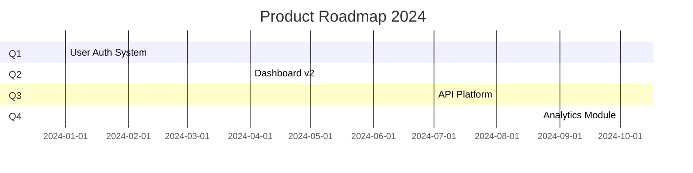

# Roadmap Planner

A workflow for creating and maintaining product roadmaps.

## Core Philosophy

**Outcome over output**: Focus on business outcomes, not just feature delivery.

## Constraints

- **ALL output must be in Chinese (中文)**: All roadmap documents must be written in Chinese.
- **Use Mermaid for diagrams**: Timeline and dependency diagrams must use Mermaid syntax.

## Roadmap Structure

### 1. Vision & Strategy
- Product vision (3-5 years)
- Strategic objectives
- Key differentiators

### 2. Themes & Goals
- Quarterly themes
- Objectives per theme
- Key results

### 3. Timeline View
- Q1/Q2/Q3/Q4 breakdown
- Major milestones
- Release dates

### 4. Feature Pipeline
| Feature | Priority | Quarter | Status | Owner |
|---------|----------|---------|--------|-------|
| ... | ... | ... | ... | ... |

### 5. Dependencies
- Technical dependencies
- Cross-team dependencies
- External dependencies

---

## Roadmap Types

### Now/Next/Later
Simple 3-horizon view for stakeholder communication.

### Timeline Roadmap
Detailed timeline with dates and milestones.

### Kanban Roadmap
Continuous flow view for agile teams.

---

## Workflow

### Step 1: Strategic Alignment
Review company strategy, market trends, user feedback.

### Step 2: Input Collection
Gather inputs from:
- Customer feedback
- Sales requests
- Competitive analysis
- Technical debt

### Step 3: Prioritization
Use RICE or WSJF scoring to prioritize initiatives.

### Step 4: Capacity Planning
Align roadmap with team capacity and dependencies.

### Step 5: Communication
Create different views for different audiences.

---

## Mermaid Timeline Example

---

## Output

Generate `docs/roadmap/{year}-roadmap.md` with full roadmap and visualizations.
