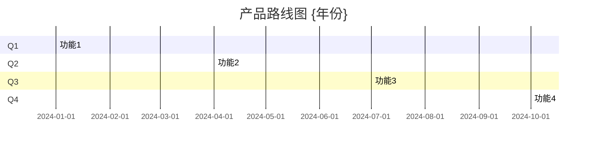
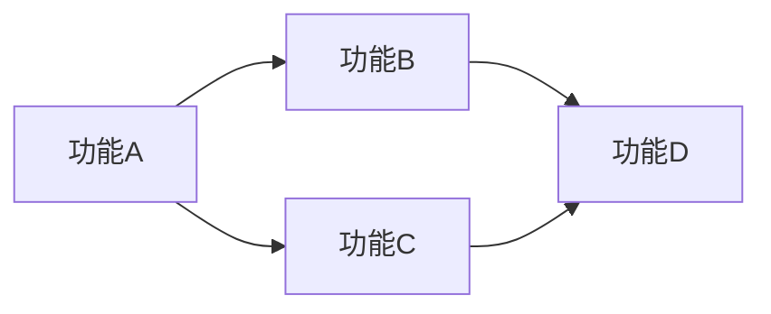

# 产品路线图模板

## 文档信息

| 项目 | 内容 |
|------|------|
| 产品名称 | |
| 版本 | v1.0 |
| 负责人 | |
| 时间范围 | {年份} Q1 - Q4 |
| 最后更新 | {日期} |

---

## 产品愿景

<!-- 3-5年愿景描述 -->

---

## 战略目标

1.
2.
3.

---

## 季度规划

### Q1 {年份}

**主题:**

**目标:**
| 目标 | 关键结果 | 负责人 |
|------|----------|--------|
| | | |

**主要功能:**
| 功能 | 优先级 | 状态 | 负责人 |
|------|--------|------|--------|
| | P0/P1/P2 | | |

---

### Q2 {年份}

**主题:**

**目标:**
| 目标 | 关键结果 | 负责人 |
|------|----------|--------|
| | | |

**主要功能:**
| 功能 | 优先级 | 状态 | 负责人 |
|------|--------|------|--------|
| | P0/P1/P2 | | |

---

### Q3 {年份}

**主题:**

**目标:**
| 目标 | 关键结果 | 负责人 |
|------|----------|--------|
| | | |

**主要功能:**
| 功能 | 优先级 | 状态 | 负责人 |
|------|--------|------|--------|
| | P0/P1/P2 | | |

---

### Q4 {年份}

**主题:**

**目标:**
| 目标 | 关键结果 | 负责人 |
|------|----------|--------|
| | | |

**主要功能:**
| 功能 | 优先级 | 状态 | 负责人 |
|------|--------|------|--------|
| | P0/P1/P2 | | |

---

## 时间线视图

---

## 依赖关系

---

## 风险与缓解

| 风险 | 影响 | 概率 | 缓解措施 |
|------|------|------|----------|
| | 高/中/低 | 高/中/低 | |

---

## 变更历史

| 版本 | 日期 | 变更内容 | 作者 |
|------|------|----------|------|
| v1.0 | | 初始版本 | |
