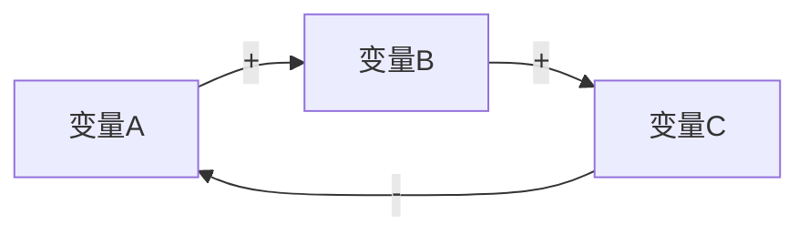

# 系统思考 (Systems Thinking)

## 核心理念
**系统是其部分之和以上的东西。** 理解行为需要理解结构——反馈回路、延迟和杠杆点。

## 约束
- 所有输出必须为中文
- 必须识别至少一个反馈回路（增强或平衡）
- 适用时参考 Donella Meadows 的杠杆点
- 使用 Mermaid 图表绘制系统图
- 使用 `templates/systems-map.md` 作为输出结构

## 适用场景
- 组织/技术瓶颈：解决了 A 但 B 变差了
- 复杂系统优化：多因多果交织
- "越修越糟"的问题
- 理解为什么好的政策产生坏结果

## 不适用场景
- 单因单果的线性问题（使用 `five-whys`）
- 需要快速决策（使用 `ooda-loop`）
- 首次理解某个概念（使用 `feynman-technique`）

## 核心概念

### 反馈回路
- **增强回路 (R)**：A ↑ → B ↑ → A ↑（滚雪球效应）
- **平衡回路 (B)**：A ↑ → B ↑ → A ↓（恒温器效应）

### 延迟
- 动作与结果之间的时间差
- 延迟是系统中最被低估的因素

### Donella Meadows 12 杠杆点（从弱到强）
12. 常量/参数/数字
11. 缓冲区大小
10. 物质流的结构
9. 延迟的长度
8. 平衡反馈回路的强度
7. 增强反馈回路的增益
6. 信息流的结构
5. 系统规则
4. 自组织能力
3. 系统目标
2. 系统范式
1. 超越范式的能力

## 工作流程

### 第 1 步：定义系统边界
> "我分析的系统是 _______ ，边界包含 _______ ，不包含 _______ 。"

### 第 2 步：识别关键变量
列出系统中的关键变量（存量和流量）：

| 变量 | 类型 | 当前趋势 |
|------|------|---------|
| ... | 存量/流量 | 增/减/稳 |

### 第 3 步：画系统图
用 Mermaid 画出变量间的因果关系：

标注：`+` 同向变化，`-` 反向变化

### 第 4 步：识别反馈回路
在系统图中标记：
- **R1, R2...** 增强回路（正反馈）
- **B1, B2...** 平衡回路（负反馈）

### 第 5 步：识别延迟和杠杆点
- 哪里有显著延迟？（标记 ⏱️）
- 对照 12 杠杆点清单，找到最有效的干预位置

### 第 6 步：提出干预策略
优先在高杠杆点干预：

| 杠杆点 | 干预措施 | 预期效果 | 可能的副作用 |
|--------|---------|---------|------------|
| ... | ... | ... | ... |

## 产出
生成系统分析报告，包含系统图和杠杆分析。使用 `templates/systems-map.md` 模板。

## 参见
- `second-order-thinking` — 二阶思维：线性因果链分析
- `five-whys` — 五个为什么：单链根因分析
- `margin-of-safety` — 安全边际：为系统延迟留缓冲
- `thinking-selector` — 不确定用哪个？
